# An android news App

- Support requesting weather and location info.
- Support fectching top headlines from Guardian News.
- Top-headlines  could  be  for  any  of  the following domains world, politics, business, technology, sports and science.
- Each news article can be shared by the user via Twitter.
- Support google trending search for keywords and line chart for trending.
- Support autocomplete search and view full news article details.
- Support saving favorite news articles and removing them.

## App Overview

### Splash Screen

### Location Permssion

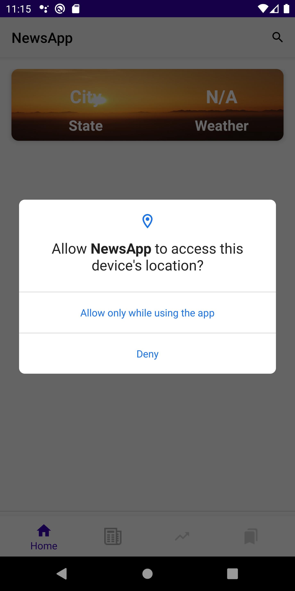

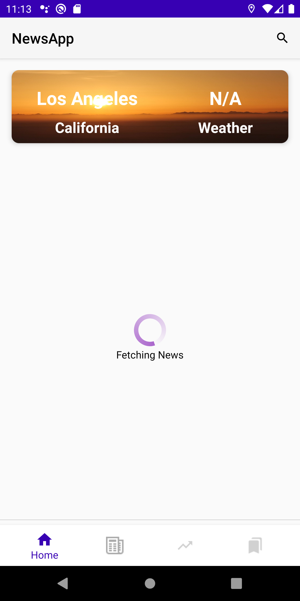

### Home

### Headlines

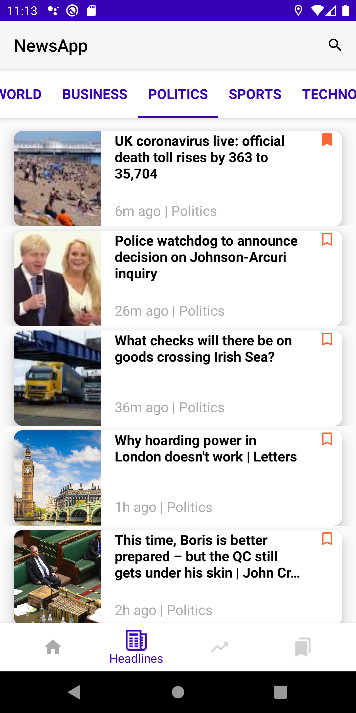

### Trending

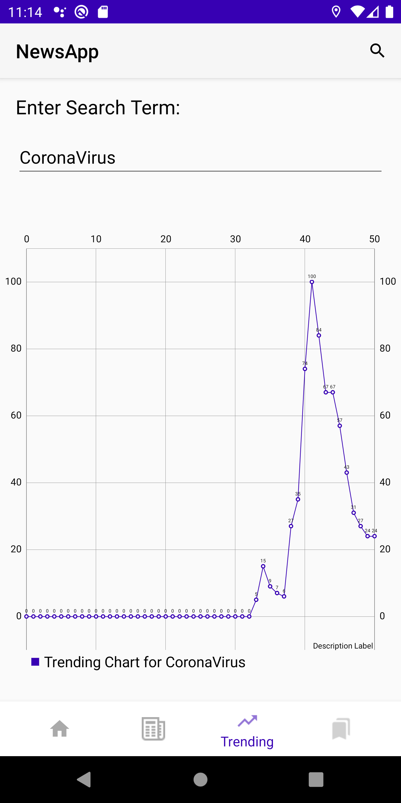

### Bookmarks

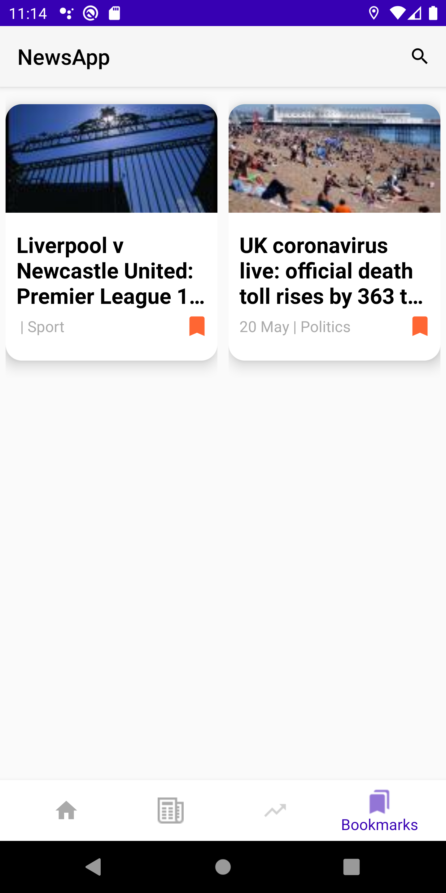

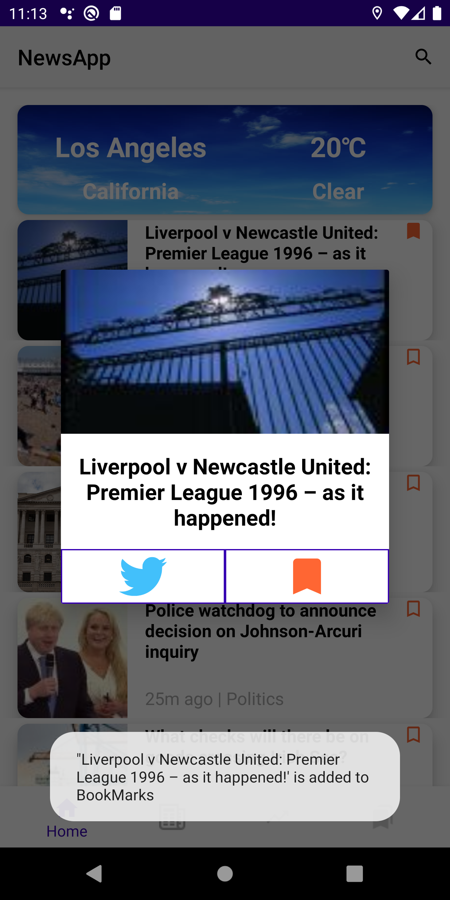

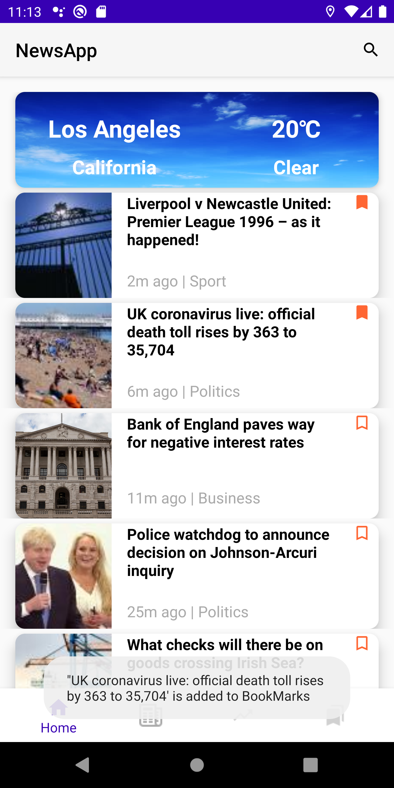

### Search

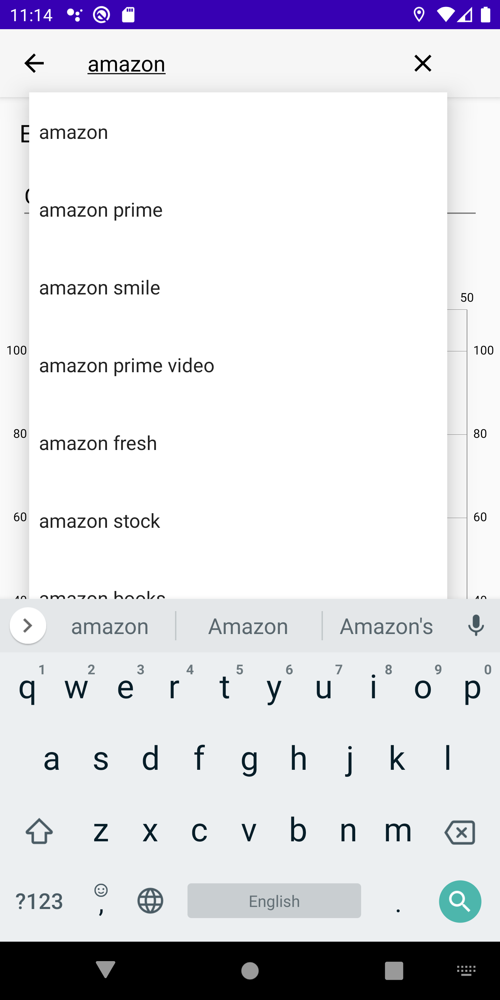

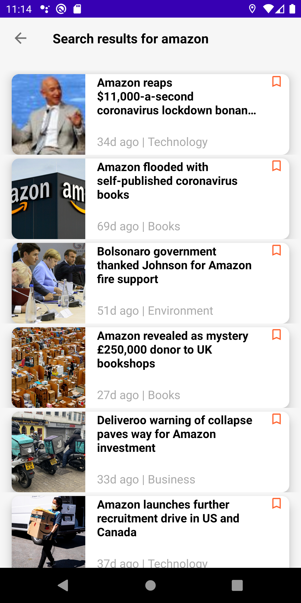

### Deatils

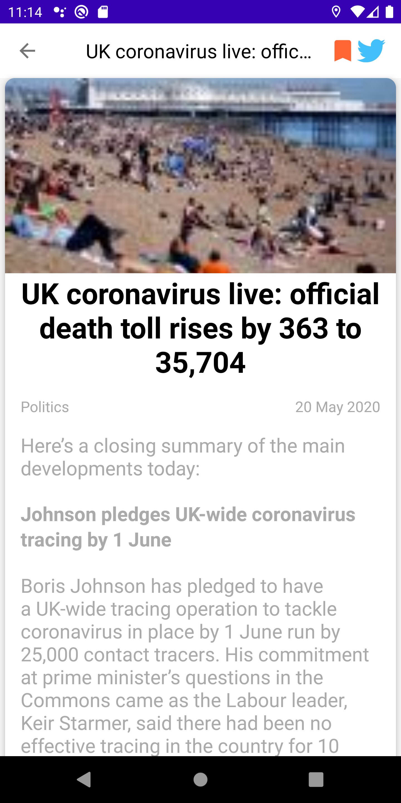

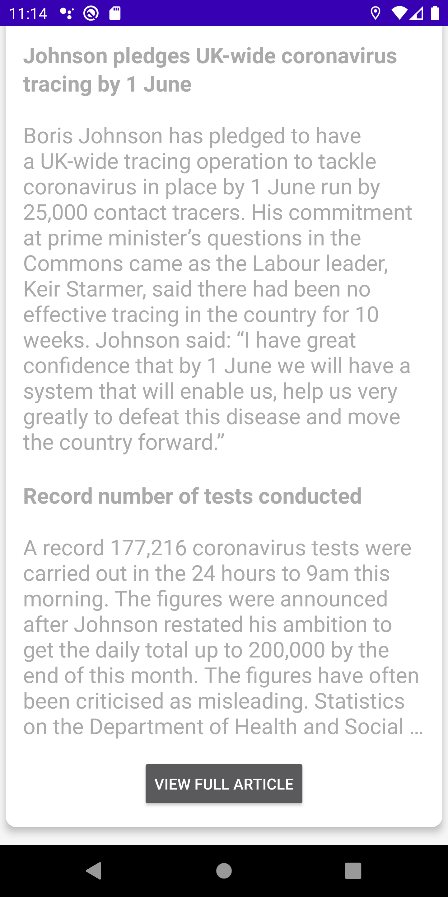

### Long Click

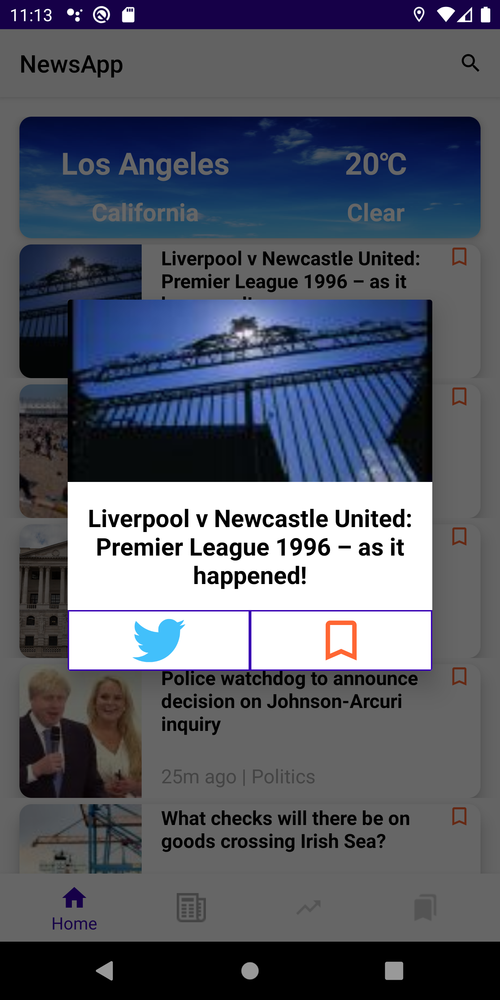

